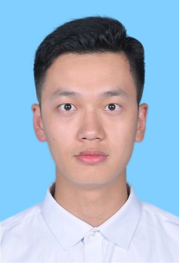

 

     
  

     <h1 style="width:15%">龙奇涵</h1>
     

         
             
             13538767738
         
         ·
         
             
             longqh3@outlook.com
         
         ·
         
             
             <a href="https://github.com/longqh3">Github</a>
         
          
          
     

 

<h2 style="width:15%"> 个人信息 </h2>

 - 男，1997 年出生，中共党员
 - 求职意向：投行业务助理

##  教育经历

- 硕士，中山大学，遗传学专业，2019.9~2022.6
- 学士，中山大学，预防医学专业，2014.9~2019.6
- 绩点：3.6，年级前 20%

##  获奖经历

- 中山大学三等奖学金：2014、2015、2017年度
- 中山大学励志奖学金：2016年度
- 国家励志奖学金：2015、2017年度
- 研究生一等奖学金：2019、2020年度
- 天津海河国际龙舟邀请赛团体第五名：2015年度

##  实习经历

- **中国人民解放军南部战区总医院**·2018.6-2018.10

  跟随带教医生学习临床技能，包括收治病人、病历撰写、提供治疗方案、分析检查检验报告等，对患者从入院到出院整个过程有较为清晰的了解和认识。

- **深圳市南山区疾病预防与控制中心**·2018.10-2019.3

  学习食品、环境、传染病突发公共卫生事件的预防、处理、善后流程，多次同职能科室带教老师前往现场处理突发公共卫生事件。

##  科研工作

- **复杂遗传病双基因遗传模式分析**（等待返修）

  ——本项目主要用以预测复杂遗传病（双向情感障碍、抑郁症等）的所有突变基因间是否存在双基因遗传模式，并精准定位疾病驱动基因。
  
  应用Python完成数据分析标准化流程构建、数据预处理、训练特征提取、模型构建等工作。

- **不同表型相关细胞类型的精准定位**（已投稿）

  ——本项目为网页数据库，存储了具有不同表型（疾病状态、身高体重等）的个体内所有类型的细胞分布状况，可应用于表型对应细胞类型的精准定位和靶向治疗。
  
  应用PHP实现网页数据库前后端接口（应用PHP实现后端对请求的响应）、部分前端可视化（应用Echarts来绘制美观的图形化报表）。

##  技能清单

- **专业能力**
  - 通过证券从业资格考试，可胜任基本分析工作
  - 了解WindQuant（万矿量化云平台）中数据可视化部分
- **计算机能力**
  - 熟练Python编程，能应用Pandas、sklearn等库快速完成数据分析工作
  - 了解PHP、R、Java编程，需要时可快速上手
- **外语能力**
  - 通过 CET4/6 英语等级考试（CET4：600，CET6：561）
  - 较强的生物医药最新研究文献阅读能力